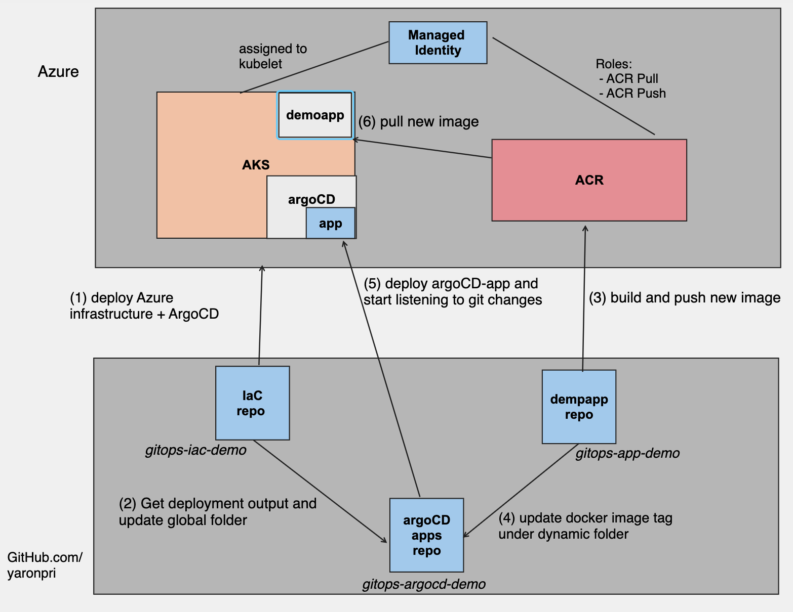

# gitops-app-demo

## About
This repo is part of three GitOps CI/CD demo repos:
- [IaC repo](https://github.com/yaronpri/gitops-iac-demo)
- [App repo](https://github.com/yaronpri/gitops-app-demo)
- [ArgoCD repo](https://github.com/yaronpri/gitops-argocd-demo)

This App repo contains a sample GO application which being containerize and pushed to ACR after every git pushusing GitHub Actions.

The GitHub Action also perform the following steps:
- Run Unit Test
- Scan the Docker image using [Aqua Trivy Custom GitHub Action](https://github.com/marketplace/actions/aqua-security-trivy)
- Update a file under dynamic folder in the related ArgoCD repo/demo-app Helm chart folder with the newly generated Docker image tag.

As a result of updating the file with the new tag value, ArgoCD sync operation will be triggered and will pull the new Docker image.

## GitOps Architecture 

## How to configure this repo
- Fork this repo
- Establish a trust between GitHub.com and your Azure subscription by configuring OpenID connect, follow [this](https://docs.github.com/en/actions/deployment/security-hardening-your-deployments/configuring-openid-connect-in-azure) article.
- Create a PAT in your GitHub account, follow this article (we will refer [this](https://docs.github.com/en/authentication/keeping-your-account-and-data-secure/creating-a-personal-access-token) value as ACTIONS_TOKEN).
- Add the following GitHub Action secrets: AZURE_CLIENT_ID, AZURE_SUBSCRIPTION_ID, AZURE_TENANT_ID (the values should taken after following OpenID connect article) and ACTIONS_TOKEN.
